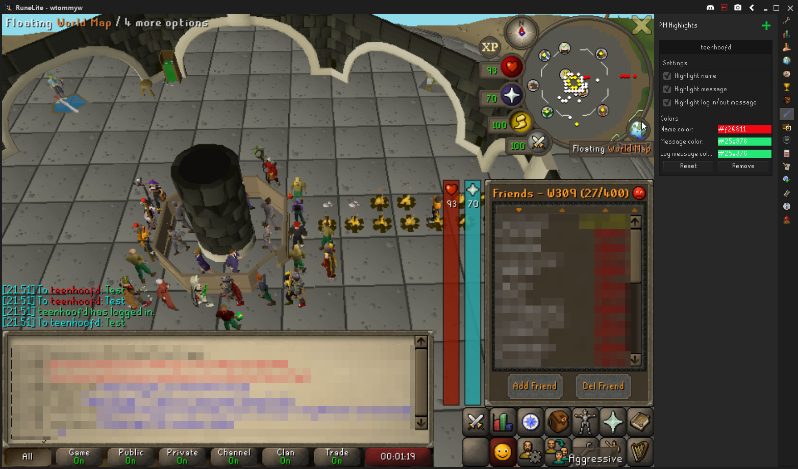

# Pm Highlight

> *Not receiving any messages?*  
> Try setting private chat to "show all", since the username is wrapped witch `col` tags it might not be recognised as a friend.

A plugin for [RuneLite](https://runelite.net/) that gives you the ability to highlight private messages from certain players.

Using this plugin you can:
- Highlight the player's name;
- Highlight the message;
- Highlight the log in/out message.

Each one of these highlight can be turned off or on in the menu on the right, simply add a player to the list using the green plus sign:

## Icons

All icons used in this plugin are created by me, the project files are availible in [this repository](https://github.com/wtommyw/pm-highlight-icons)